# ER 关系推导「开始推导」全链路（含语义匹配）深度分析

**分析日期**: 2026-09-10
**分析范围**: `web/src/components/RelationInferDialog.vue`（前端弹窗全文件）→ `POST /api/relation-infer`（WebServer.java:391 → RelationController.java:25）→ `RelationInferService.kt`（L45-483，主链路）→ `RelationSemanticPrompts.kt`（语义 prompt 组装/解析全文件）→ `TableRelationRepository.kt#upsertDerived`（L79-114）；下游含 `AiService#chat`、`AiConfigService#requireConfig`、`meta_*` 缓存仓储。

---

## 1. 概览

### 1.1 基本信息

| 项 | 内容 |
|---|---|
| 功能 | ER 关系推导：以锚点表+锚点字段为出发点，双通道（名字匹配 + LLM 语义匹配）发现候选字段对，值交集+基数验证后落 `table_relation` 三态 |
| 前端入口 | `RelationInferDialog.vue`（表列表行内「推导关联」/ ER 关系页 / 字段明细页 ER 页签三处复用） |
| HTTP | `POST /api/relation-infer`（提交，WebServer.java:391）、`GET /api/relation-infer-jobs/{id}`（1s 轮询，WebServer.java:393） |
| 核心类 | `common/src/main/kotlin/com/example/dq/service/RelationInferService.kt:45`（异步执行体 `runInfer` L121-310）；`RelationSemanticPrompts.kt:14`（纯函数 prompt 组装与解析） |
| 任务表 | `relation_infer_job`（stage/total_steps/done_steps/found_count/error），迁移 V35 |
| 结果表 | `table_relation`（方向化 one/many + CANDIDATE/CONFIRMED/REJECTED 三态 + source=NAME_MATCH/SEMANTIC/MANUAL），唯一键=四元组+两端表字段六元组 |
| 关键常量 | 单轮候选上限 `MAX_CANDIDATES=200`（RelationInferService.kt:449）、值采样上限 `DISTINCT_SAMPLE_LIMIT=1000`（L452）、粗筛批大小 `TABLE_BATCH_SIZE=100`（L455） |

### 1.2 入口与触发

用户在弹窗中选锚点字段（主键默认勾选，RelationInferDialog.vue:188）、可填映射字段名（aliases）、开「只用别名匹配」aliasOnly、开「语义匹配」useSemantic（AI 未配置时开关置灰，L70-75 + L196-202）。点击「开始推导」（L104-106）→ `submit()`（L204-230）POST 提交 → 后端**同步校验 + 异步执行**：任务行落库后丢进单线程守护线程池（RelationInferService.kt:66-68,92），前端按 1s 轮询任务详情（L233-251）直到 DONE/FAILED。**关闭弹窗只停轮询，后端任务继续跑**（L266-269），没有取消 API。

---

## 2. 核心逻辑

> 全链路按执行顺序拆解；语义匹配（用户问的重点）见 2.4/2.5。行号默认 `RelationInferService.kt`，另标者除外。

### 2.1 前端提交（RelationInferDialog.vue:204-230）

- 按钮仅在有已选锚点字段时可用（L104）；`submit()` 组装 `fields = selectedColumns.map(name → {name, aliases[]})`，aliases 去空串去重（L209-212）；连同 `useSemantic/aliasOnly` 一起 POST（L213-221）。
- 提交成功 → `phase='running'`，起 1s 定时轮询 `GET /api/relation-infer-jobs/{id}`（L233-251）；DONE → 停轮询并 emit `done`（L239-242）；FAILED → 失败页可「重新推导」（L243-246,113）。
- 弹窗打开时并行做两件事（L260-270）：拉锚点表字段列表并预选主键（L177-194）、查 `GET /ai-config` 的 `available` 决定语义开关是否可开（L196-202）。

### 2.2 提交校验与任务落库（L72-94）

顺序刻意安排：**AI 配置校验在最前**（L74-75）——`useSemantic=true` 时先 `aiConfigService.requireConfig()`（AiConfigService.kt:83-92，baseUrl/model/apiKey 任一为空抛 `IllegalStateException`），失败直接 409（WebServer.java:253-256）且**不产生任务行**；其后才是锚点表/锚点字段/schema 非空校验（L76-87，抛 `IllegalArgumentException` → 400，WebServer.java:231-234）与数据源存在性（L89）。通过后插 `relation_infer_job` RUNNING 行（L90-91）并异步执行（L92）。

锚点字段归一 `normalizeAnchorFields`（L97-108）：name/aliases trim 去空、映射名与本名忽略大小写去重（保留首次写法）、同名锚点字段忽略大小写去重。

### 2.3 阶段一 · 名字匹配（stage=NAME_MATCH，L132-195）

语义开启时**这一步照跑**——两通道是互补关系，不是二选一：

1. 整库字段清单 `schemaColumns()`（L313-334）：`meta_schema_column` 缓存优先（`isSchemaColumnsReady` 判定），未就绪则连业务库 `dialect.listSchemaColumns` 实时拉取并整粒度回填缓存。
2. 锚点字段名按缓存中的**实际大小写**归一（L136-139），后续唯一键与验证 SQL 都用真实名。
3. 构建「搜索名集合」（L142-150）：小写搜索名 → (锚点字段, 命中用映射名)；`aliasOnly=false` 时集合=本名+映射名，`aliasOnly=true` 仅映射名（无映射名的锚点字段不参与名字匹配，只记 info 日志 L151-156）；搜索名冲突先到先得。
4. 预载历史关系 `existing`（L160-165）：该 schema 下**非 REJECTED** 的关系按方向无关 key（`pairKey` L458-462，两端按字典序拼接）入集合——已确认/候选对跳过不重复验证，**否决对刻意不进集合**，为回炉留口。
5. 遍历全库字段：排除锚点表自身（L172）、忽略大小写命中（L173）、`pairKey` 已存在或本轮重复则 `dupSkips++`（L178-181）、候选未满 200 入 `candidates`（source=NAME_MATCH，映射名命中记 `hitAlias`，L183-184），超限丢弃 `truncated++`（L186）。

### 2.4 阶段二 · 语义表级粗筛（stage=SEMANTIC_TABLE，L202-232）

入口条件 `aiConfig != null`（L202，即提交时 useSemantic=true，配置在提交时已校验非空）。

1. **备原料**（L204-207）：表注释取 `meta_table` 缓存（`metaCacheRepo.listTables`），AI 表描述取 `table_doc`（`tableDocRepo.findBySchema`，扫描后 TableDocService/ScanDocService 生成的产物）；`allTables` = 字段清单去重表名。
2. **过滤可参与表**（L211-213）：排除锚点表后，每张表按「有 AI 描述用描述 → 无描述回退表注释 → 皆无则不进 prompt」取原料（RelationSemanticPrompts.kt:49-51，`hasTableScreenMaterial` L61-62 判定）。**全无注释/描述的表在语义通道出局**，但仍可能被名字匹配命中——这是「原料逐级回退」设计的兜底。
3. **分批**（L214-216）：`chunked(100)`，批次数计入 `total_steps`；每批一次 LLM 调用。
4. **逐批调 LLM**（L218-222）：`chat(aiConfig, TABLE_SCREEN_SYSTEM_PROMPT, buildTableScreenPrompt(...))`。prompt 结构（RelationSemanticPrompts.kt:37-57）：锚点表 + 表注释 + 表描述 + 「候选表(表名 — 描述或注释)」清单 + 输出指令（JSON 表名数组，如 `["flood_ctrl","basin"]`，没有相关输出 `[]`）；system 提示词要求模型从业务含义（外键引用/主从/字典对照）角度挑相关表、只输出 JSON（L25-27）。
5. **解析**（L223，RelationSemanticPrompts.kt:69-78,148-160）：允许回答带多余文字——取首个 `[` 到最后一个 `]` 截取子串解析 JSON；**表名过滤回真实清单**（忽略大小写归一，防幻觉表名）；坏 JSON/无有效项返回空列表不抛异常。
6. **容错**（L224-228）：单批失败（HTTP 非 2xx/120s 超时/响应解析失败，AiService.kt:97-129）→ warn 日志 + `jobRepo.appendNote` 附注到 job.error，**跳过该批继续其余批次**，名字匹配结果必须保住（L41-42）。
7. 每批完成 `semanticDone++` 并刷新进度（L229-230）；批间串行。最后 `relatedTables.remove(anchorTable)`（L232）防 LLM 把锚点表自己选进来。

### 2.5 阶段三 · 语义字段级精判（stage=SEMANTIC_COLUMN，L235-269）

对粗筛出的每张相关表**逐表一次 LLM 调用**：

1. 锚点侧原料（L236-239）：每个锚点字段的名+类型+注释+映射名。
2. 目标侧原料（L243-244）：该表全部字段（名+类型+注释）；但拼 prompt 时**无注释字段被剔除**（RelationSemanticPrompts.kt:95）；整表没有一个有注释字段则直接跳过不调 LLM（`hasColumnMatchMaterial` L245-246,106-107）。
3. prompt 结构（RelationSemanticPrompts.kt:84-102）：锚点表 + 锚点字段清单（带映射名的行追加「(在其他表中常见名: …)」提示，L142-144）+ 待匹配表 + 仅含注释字段清单 + 输出指令（`[{"anchor":"res_code","column":"water_code"}]`，没有对应输出 `[]`）；system 提示词限定语义为「一方引用另一方的业务编码/标识」（L29-31）。
4. 解析（L250-251，RelationSemanticPrompts.kt:114-129）：抽取 JSON 数组，每项取 `anchor`/`column` 两个文本字段，**两端都过滤回真实字段名**（忽略大小写）+ LinkedHashSet 去重；坏 JSON 返回空。
5. **合并去重**（L255-260）：`pairKey` 命中 `existing`（历史非否决关系）或本轮 `candidates`（名字匹配已占坑）则跳过——**同一字段对双通道命中时 source 优先 NAME_MATCH**（名字证据更硬，L444-445，测试 RelationInferFlowTest.kt:812-835 验证）；否则候选未满 200 入 `candidates`（source=SEMANTIC），超限丢弃。
6. 容错同粗筛：单表失败附注继续（L262-265）；每表完成 `semanticDone++`（L267-268）。
7. 两通道合计超出 200 时记 warn（L271-274）。

### 2.6 阶段四 · 逐对验证（stage=VERIFY，L277-302）

进度总步数此时定为 `semanticSteps + candidates.size`（L278）；开**一条**业务库连接串行验证每对（L281-302）。单对逻辑 `verifyAndInsert`（L346-399）：

1. **值交集**：两端各 `distinctSampleSql` 取 ≤1000 个 DISTINCT 非 NULL 值，统一 `toString().trim()`、空白串不计入（L349-350,401-414；语句超时沿用分段扫描口径 L404）。
2. **空样本分支**（L351-355）：任一侧为空（空表/字段全 NULL）→ 交集率/置信度留空（`ratio=null`），**不跑判重 SQL**（空表无重复是假象），基数只信索引缓存，remark 注明「样本为空…待复核」——空库也要能产出候选建 ER 图（L364-366）。
3. **非空分支**：交集率 = 交集数/较小样本数（`overlapRatio` L469-474，规避 NUMBER/VARCHAR 类型差）；基数判定先查 `meta_index` 缓存——唯一索引或单列主键恰好覆盖该字段 → 直接判唯一免查询（L420-423），否则 `hasDuplicateSql` 判重兜底（L429-434）。
4. **基数裁决**（L367-393）：两端唯一=ONE_TO_ONE（one 侧存字典序小者，`normalizeDirection` L465-466）；仅一端唯一=ONE_TO_MANY（one 侧存唯一方）；空样本且两端无索引佐证=暂按锚点侧为「一」存 ONE_TO_MANY + remark；两端都重复=SUSPECT_MANY_TO_MANY + remark「待人工裁决」。
5. **置信度**（L477-481）：交集率 ≥0.8=HIGH、>0=MEDIUM、=0=LOW。注意交集率**只影响置信度，不否决候选**——0% 交集照样入库（LOW），裁决权留给人工。
6. **入库幂等** `upsertDerived`（TableRelationRepository.kt:79-114）：正向/反向唯一键都查（L86-98）；无命中 → 插 CANDIDATE（L99-101）；命中 REJECTED → **回炉为 CANDIDATE**，按最新推导方向与验证数据整行刷新（含 one/many 翻转，L103-113）；命中非 REJECTED（并发/重跑撞车）→ 不动返回 null。remark 并存「经映射字段名 xx 命中」（L361-363）。
7. 单对异常=剔除该对不中断整轮（L293-298）；每对完成刷新进度（L299-300）。全部完成后 `finish`：DONE + found_count（L303）。

### 2.7 LLM 调用细节（AiService.kt:81-131）

OpenAI 兼容 `/chat/completions`，Bearer 鉴权，`temperature=0.3`（L85），请求超时 120s（L97）、连接超时 10s（L34-36）；非 2xx/空内容/解析失败统一包成 `IllegalStateException` 上抛（由语义通道的 try/catch 转为「跳过+附注」）；每次成功调用解析 usage 上报 `AiUsageService`（场景=RELATION_INFER「关系推导」，RelationInferService.kt:56-57，AiScene.kt:11-12），计入 Token/费用统计。

---

## 3. 流程图

```mermaid
flowchart TD
  classDef start fill:#e6f7e6,color:#1a1a1a,stroke:#2e8b57
  classDef danger fill:#8b0000,color:#ffffff,stroke:#5c0000
  classDef warn fill:#fff3e6,color:#1a1a1a,stroke:#d97706
  classDef llm fill:#e6f0ff,color:#1a1a1a,stroke:#3b6fd4
  classDef db fill:#f3e8ff,color:#1a1a1a,stroke:#7c3aed
  classDef done fill:#d9f2d9,color:#1a1a1a,stroke:#2e8b57,stroke-width:2px

  subgraph FE["前端 RelationInferDialog.vue"]
    A["点击「开始推导」 submit L204<br>按钮仅在已选锚点字段时可用 L104"]:::start --> B["组装 fields: 每字段 name + aliases<br>aliases 去空串去重 L209-212"]
    B --> C["POST /api/relation-infer<br>datasourceId / dbName / schemaName / table / fields / useSemantic / aliasOnly<br>L213-221"]
  end

  C --> D{"提交校验 submitInfer L72-94"}
  D -->|"useSemantic=true 且 AI 配置缺失<br>requireConfig AiConfigService L83-92"| D1["409 请先配置大模型<br>不产生任务行 L74-75"]:::danger
  D -->|"锚点表/锚点字段/schema 为空<br>或数据源不存在 L76-89"| D2["400 参数错误<br>WebServer 统一异常映射"]:::danger
  D -->|"校验通过"| E["relation_infer_job 插入 RUNNING 行<br>返回 jobId L90-91"]
  E --> F["任务进单线程守护线程池<br>异步执行 runInfer L92 L66-68"]
  F --> G["前端切 running 阶段<br>1s 轮询任务详情 L233-251"]

  F --> H["阶段一 NAME_MATCH 置位 L132"]
  subgraph NM["阶段一 · 名字匹配(语义开启时也先跑,两通道互补)"]
    H --> I["整库字段清单<br>meta_schema_column 缓存优先<br>未就绪实时拉取并回填 L313-334"]:::db
    I --> J["搜索名集合 = 本名 + 映射名<br>aliasOnly=true 时仅映射名<br>小写归一 冲突先到先得 L142-156"]
    J --> K["遍历全库字段 排除锚点表自身<br>忽略大小写命中 L171-174"]
    K --> L{"pairKey 已存在<br>历史非否决关系/本轮重复? L178"}
    L -->|"是"| M["跳过 dupSkips++"]
    L -->|"否"| N{"候选数 < 200?<br>MAX_CANDIDATES L449"}
    N -->|"是"| O["入候选 source=NAME_MATCH<br>映射名命中记 hitAlias L184"]
    N -->|"否"| P["丢弃 truncated++ L186"]
  end

  M --> Q{"aiConfig != null?<br>即语义开关 L202"}
  O --> Q
  P --> Q
  Q -->|"否 纯名字匹配"| VFY
  Q -->|"是 useSemantic=true"| ST0

  subgraph ST["阶段二 · 语义表级粗筛 SEMANTIC_TABLE L210"]
    ST0["备原料: 表注释 meta_table 缓存<br>+ AI 表描述 table_doc L204-206"]:::db
    ST0 --> ST1["可参与表 = 除锚点外<br>有 AI 描述或表注释的表<br>皆无的表不进 prompt L211-213"]
    ST1 --> ST2["按 100 张/批分批 chunked<br>TABLE_BATCH_SIZE L214 L455"]
    ST2 --> ST3["逐批调 LLM 每批一次 串行<br>system=表级粗筛角色设定<br>user=锚点表+注释/描述 + 候选表清单<br>L218-222 Prompts L37-57"]:::llm
    ST3 --> ST4{"本批调用成功?<br>单次超时 120s AiService L97"}
    ST4 -->|"否 非2xx/超时/解析失败"| ST5["warn 日志 + job.error 附注<br>跳过该批 不炸任务 L224-228"]:::warn
    ST4 -->|"是"| ST6["解析: 抽取首个 JSON 数组<br>表名过滤回真实清单 忽略大小写<br>坏 JSON 返回空 L223 Prompts L69-78"]
    ST5 --> ST7["semanticDone++ 更新进度 L229-230"]
    ST6 --> ST7
    ST7 --> ST8{"还有下一批?"}
    ST8 -->|"是"| ST3
    ST8 -->|"否"| ST9["relatedTables 移除锚点表自身<br>得语义相关表集合 L232"]
  end

  ST9 --> SC0

  subgraph SC["阶段三 · 语义字段级精判 SEMANTIC_COLUMN L235"]
    SC0["组装锚点字段原料<br>名+类型+注释+映射名提示 L236-239"]
    SC0 --> SC1{"还有下一张相关表?"}
    SC1 -->|"否"| VFIN["两通道合并完成<br>超 200 记 warn L271-274"]
    SC1 -->|"是"| SC2{"该表至少一个字段有注释?<br>hasColumnMatchMaterial L245"}
    SC2 -->|"否"| SC7["整表跳过 不调 LLM L245-246"]
    SC2 -->|"是"| SC3["调 LLM: 锚点字段 映射名作常见名提示<br>vs 该表仅有注释字段 无注释不进 prompt<br>L247-249 Prompts L84-102 L142-144"]:::llm
    SC3 --> SC4{"本表调用成功?"}
    SC4 -->|"否"| SC5["warn + job.error 附注<br>跳过该表 L262-265"]:::warn
    SC4 -->|"是"| SC6["解析字段对 anchor/column<br>两端过滤回真实字段名 + 去重<br>L250-251 Prompts L114-129"]
    SC6 --> SC8{"pairKey 已存在<br>或名字匹配已命中? L256"}
    SC8 -->|"是 source 优先 NAME_MATCH"| SC7
    SC8 -->|"否"| SC9{"候选数 < 200?"}
    SC9 -->|"是"| SC10["入候选 source=SEMANTIC L259"]
    SC9 -->|"否"| SC11["丢弃 截断 L258-260"]
    SC5 --> SC1
    SC7 --> SC1
    SC10 --> SC1
    SC11 --> SC1
  end

  VFIN --> VFY

  subgraph VF["阶段四 · 逐对验证 VERIFY L277"]
    VFY["开一条业务库连接<br>候选对串行验证 L281-302"]:::db
    VFY --> V1["两端各 distinctSampleSql<br>≤1000 个 DISTINCT 非 NULL 值<br>toString().trim() L349-350 L402-414"]
    V1 --> V2{"任一侧样本为空?<br>空表/字段全 NULL L351"}
    V2 -->|"是"| V3["交集率/置信度留空<br>不跑判重 SQL 基数只信索引缓存<br>remark 样本为空待复核 L353-365"]:::warn
    V2 -->|"否"| V4["值交集率 = 交集数/较小样本数<br>overlapRatio L469-474"]
    V4 --> V5["基数: 唯一索引/单列主键缓存短路<br>否则 hasDuplicateSql 判重 L354-355 L418-435"]
    V3 --> V6
    V5 --> V6{"基数裁决 L367-393"}
    V6 -->|"两端唯一"| V7["ONE_TO_ONE<br>one 侧=字典序小者 L368-371"]
    V6 -->|"仅一端唯一"| V8["ONE_TO_MANY<br>one 侧=唯一方 L373-379"]
    V6 -->|"空样本且两端无索引佐证"| V9["暂按锚点侧为一 存 ONE_TO_MANY<br>+ remark 待人工裁决 L381-386"]:::warn
    V6 -->|"两端都重复"| V10["SUSPECT_MANY_TO_MANY 疑似多对多<br>+ remark 待人工裁决 L387-392"]:::warn
    V7 --> V11["置信度: 交集率≥0.8 HIGH<br>>0 MEDIUM =0 LOW 只降级不否决 L477-481"]
    V8 --> V11
    V9 --> V11
    V10 --> V11
    V11 --> V12["upsertDerived 入库 table_relation L394-398"]:::db
    V12 --> V13{"命中已有行 含反向键?"}
    V13 -->|"无"| V14["插入 CANDIDATE found++<br>Repository L99-101"]
    V13 -->|"是 REJECTED"| V15["回炉 CANDIDATE<br>按最新方向整行刷新 含方向翻转<br>Repository L103-113"]
    V13 -->|"是非否决行 并发/重跑撞车"| V16["不动 dropped++<br>Repository L102"]
    V14 --> V20{"还有候选对? 单对异常则剔除不中断 L293-298"}
    V15 --> V20
    V16 --> V20
    V20 -->|"是"| VFY
  end

  V20 -->|"否"| Z["任务 DONE found_count 落库 L303"]:::done
  Z --> Z1["前端轮询到 DONE 停轮询<br>提示「发现 N 条候选关系,可在 ER 图中确认或否决」<br>L239-242"]:::done

  F -.->|"runInfer 顶层异常"| X["任务 FAILED error 落库 L306-309"]:::danger
  X --> X1["前端轮询到 FAILED<br>失败页可重新推导 L243-246 L113"]:::danger
  ST5 -.-> NOTE["单批/单表 LLM 失败只附注 job.error<br>任务仍 DONE 名字匹配结果保住 L41-42"]:::warn
  SC5 -.-> NOTE
```

---

## 4. 边界条件

| # | 边界场景 | 触发条件 | 当前处理 | 是否合理 |
|---|---------|---------|---------|---------|
| 1 | 语义开启但未配置大模型 | `useSemantic=true` 且 baseUrl/model/apiKey 任一为空 | 提交即 409，**不产生任务行**（RelationInferService.kt:74-75；AiConfigService.kt:83-92；WebServer.java:253-256） | ✅ 前置拦截，不产生脏任务；前端开关本已置灰（RelationInferDialog.vue:71） |
| 2 | 锚点表/锚点字段/schema 为空、数据源不存在 | 表单异常提交 | 400 参数错误（L76-89） | ✅ |
| 3 | 锚点字段在缓存中大小写不一致 | 用户选 `ID`、缓存实际为 `id` | 本名按缓存实际大小写归一（L136-139），唯一键/验证 SQL 用真实名 | ✅ 防唯一键对不上 |
| 4 | aliasOnly=true 但所有字段没填映射名 | 用户组合失误 | 名字匹配零命中（仅 info 日志 L151-156）；前端有黄色预警但不拦截（RelationInferDialog.vue:62-69,161-164） | ⚠️ 可跑通但大概率浪费一轮；后端无提示 |
| 5 | 整库字段缓存未就绪 | 新接入数据源直接推导 | 实时拉取 `listSchemaColumns` 并整粒度回填（L313-334） | ✅ 与 MetadataService 同口径 |
| 6 | 全库表都没有注释/描述 | 裸库首次使用 | 阶段二候选原料为空 → `batches=[]`，一次 LLM 都不调，语义通道空转后直接进阶段三/四 | ✅ 零浪费；名字匹配仍工作 |
| 7 | 相关表所有字段都无注释 | 阶段二筛出的表无字段注释 | 整表跳过不调 LLM（L245-246） | ✅ 省调用；该表仍可被名字匹配兜底 |
| 8 | LLM 回答带多余文字/坏 JSON/幻觉表名字段名 | 模型不守指令 | 取首个 `[…]` 截段解析；表名/字段名过滤回真实清单（忽略大小写）；坏 JSON 返回空不抛异常（Prompts L69-78,114-129,148-160） | ✅ 容错充分，幻觉不可能产生脏候选 |
| 9 | 单批/单表 LLM 调用失败 | 超时 120s、非 2xx、响应空/解析失败 | warn + job.error 附注，跳过继续，任务最终仍 DONE（L224-228,262-265；测试 RelationInferFlowTest.kt:780-809） | ⚠️ 名字匹配结果保住了，但失败批次静默降级（见坑点 3） |
| 10 | 双通道命中同一字段对 | 名字与语义都发现同对 | 合并去重，source 优先 NAME_MATCH（L255-256；测试 L812-835） | ✅ 证据更强的来源胜出 |
| 11 | 历史已确认/候选对再次被推导命中 | 重复推导 | `existing` 跳过，不重复验证不重复插入（L178-181）；确认关系永不降级 | ✅ 幂等 |
| 12 | 历史已否决对再次被推导命中 | 用户否决后又推 | **不跳过**——重新验证并回炉 CANDIDATE，同 id 整行刷新含方向翻转（L159 + Repository L86-113） | ✅ 数据变了能「翻案」，测试覆盖（RelationInferFlowTest.kt:248-289） |
| 13 | 候选超 200 | `id` 等通用名全库命中 | 截断丢弃 + warn（L183-187,258-260,271-274） | ⚠️ 名字匹配先到先得占坑，语义候选可能整体被挤出（见坑点 4） |
| 14 | 空表/字段全 NULL | 空库也要产出候选 | 不剔除：交集率/置信度留空、不跑判重 SQL、基数只信索引、无佐证暂按锚点侧为「一」+ remark（L351-355,364-366,381-386） | ✅ 有明确 remark 引导人工复核 |
| 15 | 单对验证 SQL 异常 | 权限/超时/方言差异 | 剔除该对、warn、不中断整轮（L293-298） | ✅ |
| 16 | 值交集率 0% | 两字段值域完全不相交 | 仍入库，仅置信度 LOW（L477-481） | ✅ 发现与验证分离，裁决权在人工 |
| 17 | 服务重启 | 推导跑到一半 | 残留 RUNNING 统一标 FAILED「服务重启,推导任务中断」，不做断点续推（RelationInferJobRepository.kt:82-90；ServiceEnv.kt:190） | ⚠️ 语义大库任务重启代价高，只能整轮重推 |
| 18 | 推导中途关闭弹窗/刷新页面 | 用户不耐烦 | 前端停轮询，后端任务继续跑完，候选照常入库（RelationInferDialog.vue:266-269） | ✅ 但无取消手段（见坑点 6） |
| 19 | 连续提交多轮推导 | 上轮语义还没跑完 | 单线程 executor **串行排队**（L66-68），后提交的任务长时间停在「准备中」 | ⚠️ 见坑点 6 |

---

## 5. 坑点

### 坑 1: 语义任务进度条口径不均匀，且纯名字匹配阶段不计步
- **现象**: 大库推导时进度条长时间不动，或从 0% 瞬间跳到 60%。
- **根因**: `total_steps` 在名字匹配阶段一直是 0（RelationInferService.kt:132 不调 `updateProgress`），直到语义阶段才= 批次数+精判表数（L215,240），验证阶段再加候选对数（L278）；前端 `percent = doneSteps/totalSteps`（RelationInferDialog.vue:166-169）。
- **影响**: 语义粗筛批次少的库（表少但候选多），前两个阶段刷得飞快、验证阶段每对只推进一小格；反之表多的库粗筛占比高。用户对「还要多久」没有稳定预期。
- **建议**: 把名字匹配也计入总步数（恒定 1 步或按锚点字段数），或在阶段文案旁展示「第 x/y 批表级粗筛」细化粒度。

### 坑 2: 值交集用 `toString().trim()` 字符串比对，格式差异会压低交集率
- **现象**: 明显相关（如 `res_code` NUMBER 1..10 vs VARCHAR '1'..'10'）的字段对置信度只有 MEDIUM/LOW。
- **根因**: `distinctValues` 把值统一 `toString().trim()` 后求交集（RelationInferService.kt:408-410），前导零、科学计数法、日期格式差异都会判不等。
- **影响**: 只降置信度不否决（L477-481），候选不丢，但人工排序时真关系可能排在低置信区。
- **建议**: 对数值型列做数值归一（去前导零/统一小数）后再比对；属于「验证证据精度」优化，不紧急。

### 坑 3: 语义批次失败只附注 job.error，完成页不展示——用户无感知降级
- **现象**: 某批表级粗筛超时失败，这批表整批漏推，但弹窗照常显示「推导完成，发现 N 条候选关系」。
- **根因**: 失败附注进 `relation_infer_job.error`（L227,264），任务状态仍是 DONE（L303）；前端 done 阶段只展示 `foundCount`（RelationInferDialog.vue:91-96），error 无出口（仅任务详情接口可见）。
- **影响**: 用户以为推全了，实际部分表从未参与语义匹配；失败批次也无重试，只能整轮重推。
- **建议**: 完成页检测 `job.error` 非空时展示「部分批次失败」警告条；给失败批次增加一次重试。

### 坑 4: 候选上限 200 全局共享，名字匹配先到先得可能挤掉语义候选
- **现象**: `id`/`code` 类通用名全库命中几百对时，语义通道发现的「字段名不同但语义相关」对（恰是语义通道的价值所在）可能整批进不了候选。
- **根因**: 名字匹配先执行并先占 `candidates`（L183-187），语义阶段只判断 `candidates.size < candidateLimit`（L258-260），无按通道配额。
- **影响**: 通用名锚点 + 大库场景下，语义通道白跑（LLM 调用照常花钱）。
- **建议**: 按通道设配额（如名字 100 + 语义 100），或语义候选优先（名字同名字段对用户自己就能看出来）。

### 坑 5: 语义粗筛合法表名集合包含锚点表，依赖后续 remove 兜底
- **现象**: 无——当前逻辑正确。
- **根因**: `parseRelatedTables(answer, allTables)` 传入的合法集含锚点表自身（L223 传 `allTables`），若 LLM 把锚点表选为「相关表」，会先进 `relatedTables`，靠 L232 显式移除才不出现在阶段二。
- **影响**: 逻辑正确但脆弱：若后续有人在 L232 之前消费 `relatedTables` 就会引入自关联候选。
- **建议**: 解析时直接传 `allTables - anchorTable`，把不变量收敛到解析入口。

### 坑 6: 任务不可取消 + 单线程 executor 串行，长语义任务会阻塞后续推导
- **现象**: 连点两轮推导，第二轮一直「准备中」。
- **根因**: `newSingleThreadExecutor`（L66-68）任务严格串行；没有取消 API，前端关弹窗只是停轮询（RelationInferDialog.vue:266-269）。
- **影响**: 大库语义任务（批次数+精判表数 × 单次最长 120s）可能占用推导线程几十分钟，期间所有新任务排队。
- **建议**: 至少加「取消运行中任务」的协作式停止标记（批间/对间检查）；进一步可做批内 LLM 调用并发（2-4 路）。

---

## 6. 上下游依赖

### 6.1 上游（谁调用）

- 前端 `RelationInferDialog.vue`（表列表页 Tables.vue 行内「推导关联」、ER 关系页 RelationGraph.vue、字段明细页 TableDetail.vue ER 页签三处入口，docs/wiki/ER关系推导.md「三处入口」节）
- HTTP：`POST /api/relation-infer`（WebServer.java:391 → RelationController.java:25-29）、`GET /api/relation-infer-jobs*`（轮询/历史）
- 启动：ServiceEnv.kt:190 组装服务并调用 `failRunningOnStartup()` 清残留 RUNNING

### 6.2 下游（调用谁 / 产出被谁消费）

- 数据面：`meta_schema_column`/`meta_table`/`meta_index` 结构缓存（MetaCacheRepository，懒加载 + 回填）、业务库 JDBC（distinctSampleSql/hasDuplicateSql，DbDialect.kt:159,162）
- LLM 面：`AiConfigService.requireConfig`（AiConfigService.kt:83-92）→ `AiService.chat`（AiService.kt:81-131）→ AiUsageService 用量/费用（场景 RELATION_INFER）
- 产出消费：`table_relation` CANDIDATE 行 → `TableRelationService.graph()` 组 ER 图数据（全库总图默认只画确认边、候选边按开关；星型图恒含候选）→ 前端 RelationEdgeDrawer 人工确认/否决/删除

---

## 7. 优化建议

### P0（立即修复）
1. **完成页透出部分失败信息**（坑 3）：done 分支读取 `job.error`，非空时加警告条「有 N 批语义调用失败，结果可能不完整，详情见任务记录」。改动仅前端一处，收益是消除「静默漏推」。

### P1（近期修复）
1. **失败批次重试一次**：粗筛批/精判表失败后立即重试 1 次（指数退避可选），仍失败才附注。多数 LLM 瞬时超时可被吸收，避免整轮重推。
2. **候选上限按通道配额**（坑 4）：`candidateLimit` 拆为名字/语义两段（如 100+100），保证语义通道在大库通用名场景下仍有产出。
3. **任务协作式取消**：`relation_infer_job` 加 cancel 请求位，runInfer 在每批/每对边界检查，命中即终止并标 CANCELED。

### P2（中期优化）
1. **批内 LLM 并发**：粗筛批次间/精判表间用 2-4 路并发（注意保持进度计数线程安全），大库耗时线性下降；单线程 executor 的任务级串行不变。
2. **粗筛结果复用**：同数据源+库+锚点表的粗筛结果（相关表集合）按表清单版本缓存，重推时跳过阶段二直接精判。
3. **进度口径平滑**（坑 1）：名字匹配计入总步数；前端阶段文案带批次序号。
4. **数值交集归一**（坑 2）：数值列去前导零/统一格式后再比对，提升置信度排序质量。

---

## 8. 架构观察

### 8.1 设计哲学

- **发现与验证分离**：名字/语义两通道只负责「猜对子」（高召回、宁滥勿缺），值交集+基数负责「验一遍」（证据量化），最终裁决权保留给人工（三态 + ER 图确认/否决）。语义命中从不直接入库，必须过验证——LLM 幻觉被结构性挡在候选合并之后。
- **原料逐级回退**：AI 表描述 → 表注释 → 不参与；字段注释缺失 → 逐字段/逐表降级出局。对「注释质量参差不齐」的厂商库鲁棒，且每级降级都有名字匹配兜底。
- **降级不失败**：单批/单表 LLM 失败附注继续，语义通道任何故障都不影响名字匹配结果落库（L41-42）；只有提交时配置缺失这一种「硬失败」。
- **纯函数 prompt 层**：`RelationSemanticPrompts` 全部纯函数（组装+解析），LLM 依赖被收敛到单一 `chat` lambda 注入点（L56-57），测试用假 HTTP 端点即可覆盖全流程（RelationInferFlowTest.kt:655-835），不 mock 内部逻辑。

### 8.2 优点

- 幂等设计完整：方向无关 pairKey + 方向归一化 + upsertDerived 唯一键兜底，重跑/并发/否决回炉都不会产生重复或互相覆盖
- 容错梯度清晰：解析容错（坏 JSON 返回空）→ 调用容错（单批跳过）→ 任务容错（顶层 fail），层层设防
- 进度可观测：stage 四阶段 + total/done steps + found_count，前端 1s 轮询即可渲染三段式进度
- 成本可控：批大小 100、候选上限 200、采样上限 1000、语句超时复用全局扫描口径，最坏情况有界

### 8.3 缺点

- 语义通道完全串行，大库耗时 = (批次数+精判表数) × 单次调用时长，上限 120s/次，无并发无重试
- 失败附注（job.error）与终态（DONE）语义混用，「部分成功」状态对前端不可见
- 名字匹配阶段不计入进度、候选上限通道间先到先得，两处「先来者占优」的隐式策略缺乏调节手段

---

*分析完成（deep-analyze，只读分析，未改动任何源码）*
