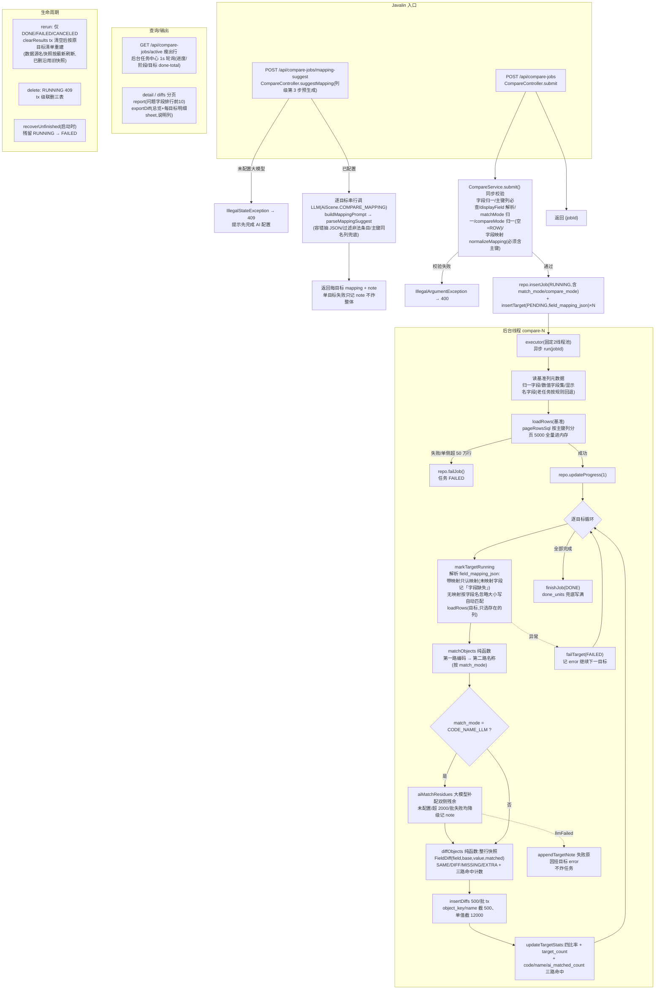

# 📋 需求还原报告 — 数据比对(compare)

> 需求还原模式产出:从代码逐行反推业务需求。概览见 [数据比对 wiki](../wiki/数据比对.md),本文档补充逐方法的业务规则细节。

## 阅读范围

- `server/src/main/java/com/example/dq/controller/CompareController.java`(入口,Javalin handler)
- `common/src/main/kotlin/com/example/dq/service/CompareService.kt`(核心业务,~950 行)
- `common/src/main/kotlin/com/example/dq/repository/CompareRepository.kt`(存储层)
- `common/src/main/kotlin/com/example/dq/model/CompareModels.kt`(请求/视图模型)
- `common/src/main/resources/db/migration/V43__compare_job.sql` 及后续迁移(三表 + display_field/target_count 列)
- 测试:`CompareDiffTest`(纯函数)、`CompareExportTest`(导出单测)、`CompareExportFlowTest`(Testcontainers 全链路)

## 一、业务场景概述

以一张**基准表**为权威,与**多个目标系统**(跨数据源/跨库)中的对应表,按单一主键列对齐后逐字段比对,
产出四类差异明细(SAME/DIFF/MISSING/EXTRA)与四项质量比率(覆盖率/字段一致率/完整率/综合评分)。
属于**长时后台任务**模型:提交即返回 jobId,前端轮询进度;落 H2 持久化,重启可恢复。

## 二、核心数据模型

| 实体 | 关键字段 | 业务含义 |
|------|---------|---------|
| `compare_job` | key_field, fields_json, **display_field**(对象名称字段,可空), **match_mode**(对象匹配逻辑,可空=V49 之前的老任务), status, total_units/done_units, archived | 任务;进度单元总数 = 1(基准读取) + 目标数 |
| `compare_target` | ds_name(**名称快照**), base/target/matched/**code/name/ai_matched**/missing/extra/field_mismatch 计数, 四比率 | 每目标一行的指标;`target_count`=目标侧实际读到的总行数(身份列为空的代理键行也进比对,老任务 NULL);`no_key_rows`=身份列为空的行数(编码路不参与、名称/大模型可配对,V63,老任务 NULL);`code/name/ai_matched_count`=三路对齐各自命中数(V49,老任务 NULL);快照保证数据源改名/删除后仍可展示 |
| `compare_diff` | object_key, object_name, diff_type, diff_json, **match_by** | 差异明细;**diff_json 为整行快照**,见 3.6;`match_by`=该行对象对齐来源 CODE/NAME/LLM(V49,老数据 NULL)|

- 三表**无外键**,删除任务由 service 层 tx 级联删(同 object_dir 惯例)。
- `object_name`(显示名)= `display_field` 列值的 trim;显示名字段用户可指定(必须属于比对字段),
  未指定则自动取比对字段中第一个文本型(字符型或 CLOB/NCLOB)非主键字段。

## 三、业务流程(按方法拆解)

### 3.1 submit — 提交任务(同步校验)

文件: `CompareService.kt:69`

- 入参校验规则(均 `IllegalArgumentException` → 400):
  - 任务名称、基准数据源、基准表、比对主键**必填**;
  - fields 去空白去重后**非空**,且**必须包含主键字段**(忽略大小写);
  - 至少一个有效目标(datasourceId 非空且 table 非空白);
  - 请求字段名归一为**基准表实际列名**(忽略大小写映射,`baseByName`);
  - 每个目标:表必须存在、**必须含主键列**(缺主键列直接报错);
  - ⚠️ 目标缺**其他**比对列**不报错**——允许提交,比对时记「字段缺失」按不一致计;
  - `displayField`(对象名称字段)可选:指定则必须属于比对字段且存在于基准表(`resolveDisplayField`)。
  - `matchMode`(对象匹配逻辑)可选:空 = `EXACT`;给出非法值 → 400「非法匹配逻辑: …」;
    `CODE_THEN_NAME`/`CODE_NAME_LLM` **必须能解析出对象名称字段**,否则 400「…需要按对象名称配对,请在「选择基准表」里指定对象名称字段」。
- 落库:任务置 RUNNING、total=1+目标数,目标置 PENDING,随即提交线程池后台执行;`match_mode` 一并落库。

### 3.2 run — 后台执行体

文件: `CompareService.kt:154`

1. 读基准侧列元数据 → 归一字段名 → 识别**数值字段集**(jdbcType 数值型)与**显示名字段**;
2. `loadRows` 拉基准全量进内存 → progress +1;
3. 逐目标:markTargetRunning → `compareOneTarget` → 任一目标失败仅该 target 置 FAILED 记 error,**继续下一个**;
4. 基准读取失败 → **整个任务 FAILED**。
- 执行器:固定 2 线程池,线程名 `compare-N`,守护线程。
- 进度语义:done_units 增量推进,stage 为当前阶段文案;`finishJob` 兜底 `done_units=total_units` 消除计数与终态不一致。

### 3.3 loadRows — 分页拉全量

文件: `CompareService.kt:240`

- 复用方言 `pageRowsSql`,按**主键列 orderBy** 分页,pageSize **5000**;
- 单条 SQL 超时 = 系统设置的 statementTimeoutSeconds(与分段扫描同口径);
- key = 主键值 `toString().trim()`;**主键为空的行不丢弃**:以行内代理键(`\u0002`+序号)进 map,编码路无命中、名称/大模型路可配对(「任意一边 code 空就用 name 匹配」),行数随结果透出(warn 日志 + 目标说明 + 导出差异原因);
- 行值一律 `rs.getObject()?.toString()`;
- **单侧超过 50 万行抛 IllegalStateException**(「请缩小比对范围」)→ 该侧任务/目标 FAILED。

### 3.4 compareOneTarget — 单目标比对与指标

文件: `CompareService.kt:200`

- 目标侧字段映射忽略大小写;**只 SELECT 目标侧存在的列**,缺列不进 map(两侧行 map 的键都归一为基准字段名);
- 对象对齐:**先**跑 `matchObjects`(编码/名称两路纯函数),`match_mode=CODE_NAME_LLM` 时**再**把残余交大模型补配
  (见 3.5/3.6),配对结果并入后交给 `diffObjects` 逐对比较;
- `diffObjects` 纯函数产出四类明细 → 500/批 tx 批量落 `compare_diff`;
- 配对行的 `object_key` 取**基准侧键**(两侧编码不同时以基准对象为视角);`match_by` 落该配对来源(CODE/NAME/LLM);
- diff_json 单值**截断 12000 字符**(匹配逻辑 2/3 下两侧标识都不同的对象说明文案更长,放宽防截断误导);
  object_key/name 截 500;
- 四项比率(compare_target):
  - 覆盖率 = matched / base_count(base 为 0 记 0)
  - 字段一致率 = 1 − field_mismatch / (matched × 比对字段数),分母 0 记 **1.0**
  - 完整率 = 目标侧已比对单元格中非空占比(列缺失按空计),分母 0 记 1.0
  - 综合评分 = 覆盖率×0.4 + 一致率×0.4 + 完整率×0.2
  - `target_count` = 实际读到的总行数(LoadedRows.totalRead,含多余行与身份列为空的代理键行),`base_count` 同为基准表实际读到的总行数,总览表「条数/与基准差」用;老任务无此列时按 matched+extra 兜底;
  - `code/name/ai_matched_count` = 三路各自命中的对象数(三者之和 = matched),展示层老任务按「编码 = matched、名称/AI = 0」解读。

### 3.5 matchObjects — 对象对齐纯函数(匹配逻辑 1/2)

文件: `CompareService.kt`(文件级 `matchObjects` + `MatchMode`)

- 输入:基准/目标全量行 map(键 = 各自编码值)、`keyField`(编码字段)、`nameField`(名称字段,可空)、`mode`;
- 第一路按编码配:两侧该字段 trim 后**区分大小写**比较(与老实现「拿编码值当行 map 的键」一致,历史结果不回归),
  空值不参与(身份列为空的代理键行自然无命中,留给第二路/大模型),命中一对记一对(老任务 `LEGACY` 与 `EXACT` 都靠它);
- 第二路按名称配(仅 `CODE_THEN_NAME`/`CODE_NAME_LLM` 且 nameField 非空):只处理编码路没配上的残余,
  目标侧残余按名称建索引(重名只留先出现的一条)、基准侧残余逐个查;
- **一个键只配一次**,不串行;配对顺序固定「编码在前、名称在后」,便于按来源计数;
- 返回 `MatchResult(pairs, codeMatched, nameMatched, …)`;`residues()` 给出两侧残余键(大模型补配的输入);
- `MatchMode.fromValue` 把数据库值归一:空/未知 → `LEGACY`(仅编码);`EXACT`/`CODE_THEN_NAME`/`CODE_NAME_LLM` 由 `normalize` 校验。

### 3.6 diffObjects — 逐字段比较纯函数

- 以配对为视角(显式 `appliedPairs` 里的配对优先,其余按「编码值相等」自动配对):配对行两侧键不等也算命中;
  配对之外:基准侧行 → **MISSING**、目标侧行 → **EXTRA**;
- 配对行逐字段比较,全部一致 → **SAME**,否则 **DIFF**;
- 匹配语义两套:显式配对(来自 `matchObjects` + 大模型补配)按配对逐对比较;未在配对里的行按
  「编码值相等」自动配对(不传 `appliedPairs` 时的旧口径,老测试/直接调用方走这条);
- **整行快照契约**(新):DIFF/MISSING/EXTRA 三类行的 diff_json 都为**全部比对字段**各生成一条
  `FieldDiff(field, base, value, matched)`——`value` 一律存**目标侧真实值**(一致字段也有值),
  `matched` 显式标定该字段是否一致。这样界面/导出单看 diff_json 就能「每格显示真实值」:
  - DIFF 行:base=基准值、value=目标真实值(一致字段也有值),matched 标定是否一致;
  - MISSING 行:base=基准值、value 全 null(目标整行不存在),matched 恒 false;
  - EXTRA 行:base 全 null(基准整行不存在)、value=目标真实值,matched 恒 false;
  - 目标缺列:命中行该字段 value 置 `«字段缺失»` 特殊标记、matched=false。
- **老数据兼容**:`matched` 为 null 的旧数据按旧契约「value 非空即不一致」解读(`FieldDiff.isMismatch`,`:577`),
  老任务(只有不一致字段的紧凑 diff_json)仍能正常展示与导出。
- 字段比较 `valuesEqual`(`:925`):
  1. 双侧 trim;**NULL 与空串(含全空白)视为一致**;
  2. 数值字段(基准侧 jdbcType 判定):去千分位逗号转 BigDecimal,`compareTo==0` 判等;
     **任一侧解析失败回落 trim 后字符串相等**;
  3. 其余 trim 后字符串相等。

### 3.7 大模型归一化补配(匹配逻辑 3)

文件: `CompareService.kt`(实例侧 `aiMatchResidues`)+ `CompareMatchPrompts`(纯函数)

- 触发条件:`match_mode=CODE_NAME_LLM` 且编码/名称两路存在**双侧残余**;
- 未配置大模型 → 不调用,直接返回说明「未配置大模型,N 条基准侧残余与 M 条目标侧残余按未匹配处理」;
- 双侧任一残余超过 `LLM_RESIDUE_LIMIT`(2000)→ 不调用,说明「残余对象过多…未做归一化补配」;
- 分批:单批基准条数 = `MAX_PAIRS_PER_REQUEST`(5000)÷ 目标侧残余数,下限 `LLM_MIN_BATCH_SIZE`(5);
  prompt 里两侧只带「编码 + 名称」(字段名做标签、空值省略、单值截 80 字符),要求输出
  `[{"b":基准序号,"t":目标序号}]`(`CompareMatchPrompts.buildMatchPrompt`);
- 解析容错(`parsePairs`):抽取首个 JSON 数组、容忍数组前后多余文字、序号兼容数字/字符串、
  越界序号丢弃、同一序号重复出现只保留先出现的一条、坏 JSON 返回空;跨批再按 base/target 去重;
- 单批调用失败只跳过该批(累计最多 3 条原因)继续,`llmFailed=true` 时把说明追加进 `compare_target.error`
  (`appendTargetNote`,追加不覆盖)——**大模型侧任何问题都不会让目标或任务 FAILED**;
- 调用场景 `AiScene.COMPARE_MATCH`(「比对匹配」),Token/费用计入 AI 用量统计。

### 3.8 rerun / delete / recoverUnfinished — 生命周期

- rerun(`:131`):仅 DONE/FAILED/CANCELED;tx 清空目标+明细后**按原目标清单重建**;数据源名快照按最新刷新,数据源已删则沿用旧快照(执行时该目标失败);
- delete:RUNNING 中禁止删(409);tx 级联删三表;
- recoverUnfinished(`:680`):启动时残留 RUNNING 任务及其未终态目标置 FAILED,error「应用重启,任务中断」。

### 3.9 exportDiff — 比对报告导出(客户核对表格式)

文件: `CompareService.kt:324`

- **sheet 1「总览」**:一行一个系统,首行基准表;列口径(表中文名/表英文名称/所属系统/条数/数据最新更新时间/与基准差/匹配编码数/匹配对象数/差异条数/差异原因);
  表中文名取表注释,所属系统取 `table_system` 登记(回落数据源名),数据最新更新时间 = 比对执行时探测时间字段
  (update 类优先,其次 create 类;未命中交大模型语义挑,AiScene.COMPARE_TIME)取 `MAX(值)` 落库的快照(V60,
  老任务/无可用字段/取数失败/大模型未配置一律留空),
  差异条数 = 数量差异(缺失 + 多余的对象数;总览只做行级数量对比,属性差异——编码不一致、字段值不一致——不计,
  在「行级对比明细」与各目标明细 sheet 体现;行级 sheet 行数 = 差异条数 + 编码不一致对象数),
  差异原因按差异构成自动拼写(与基准完全一致 / 缺失多余与编码不一致明细 / 行数相差);
- **之后每个有差异的目标一个明细 sheet**(名「序号_表名_数据源名」,序号与总览行一一对应,表名靠前防 31 字符截断):
  - 第 1 行单行上下文:`系统 · 目标表 ← 基准表 · 主键 · 目标 N 行/基准 M 行 · 差异构成`;
  - 第 3 行表头 = diff_json 出现过的字段(**字段注释做中文列名**,无注释回落字段名)+ 末列「说明」;
  - 一行一个差异对象,**一格一个对象**:字段列取目标取值(缺失行取基准值);
    「说明」解释差异——MISSING→`基准有目标无`、EXTRA→`目标有基准无`、
    DIFF→`中文列名: 基准「基准值」→ 目标「目标值」`(多字段 `;` 连接;空值显示`(空)`;
    目标缺列写`目标无此列(基准为「…」)`;业务表无此字段的字段行不落该 sheet——只放基准与业务表之间的数据差异);
- 行数超 `MAX_ROWS_PER_SHEET`(100 万,Excel 单表上限)截断并追加说明行;系统数超 Excel sheet 上限直接报错;
- `ExportContext`(`:397`)预取表注释/所属系统/字段注释,元数据不可达静默降级,**导出必须能出文件**。

### 3.10 report — 质量报告

- 目标指标 + **问题字段排行**(解析全部 DIFF 行 diff_json,按 `matched` 判定不一致后按字段计数,降序取前 10,同数按字段名升序)+ 汇总;
- `baseCount` 取各目标 base_count 最大值;`avgFieldConsistency` 为各目标一致率平均,无完成目标记 1.0。

### 3.11 diffs — 差异明细分页查询

- targetId/diffType/kw 组合过滤;diffType 非法值 400;kw 对 object_key/object_name 做 LIKE 包含;page≥1,size∈[1,500] 缺省 20;按 id 升序;
- ⚠️ Controller 注释记录的坑:Javalin `queryParamAsClass(...).getOrDefault(T)` 是 Kotlin 方法形参非空,Java 侧必须对可缺省的 targetId 用 `getOrNull()`,否则一律 500(`CompareController.java:41-43`)。

## 四、隐藏的业务含义(⚠️)

1. **数值一致性只按基准侧 jdbcType 判定**:目标侧同名列即使是文本类型,只要基准侧是数值型就走 BigDecimal 归一——设计意图是"基准表为权威口径"。
2. **50 万行上限**(`MAX_SIDE_ROWS`)是内存保护:全量进 `LinkedHashMap`,不设限会 OOM;超出时任务 FAILED 并明确提示缩小范围。
3. **重跑会按最新 match_mode 口径重算**:`rerun` 沿用任务行上的 `match_mode`(库里的值),不会回退到老口径;
   老任务不改 `match_mode` 时口径与历史一致。
4. **匹配 key 是字符串 trim 后比较**:主键值 `1` 与 `1.0`(如目标侧主键是 DECIMAL)会判为**不同对象**——一个 MISSING 一个 EXTRA,不会 DIFF。
   纯函数未对主键做数值归一;编码/名称两路都只做「trim + 忽略大小写」,不做全角/空格/标点归一(要更宽松的辨认交给匹配逻辑 3)。
4. **完整率分母含列缺失单元格**:目标缺列时该字段所有命中行的单元格计入 comparedCells 但不计 nonNullCells,会直接拉低完整率。
5. **diff_json 截断 12000 字符**(原 4000):整行快照 + 匹配逻辑 2/3 下「基准值 → 目标值」两侧标识都不同的对象,说明文案明显更长;导出的值仍可能非完整原文(CLOB 场景)。
6. **进度单元 = 1 + 目标数**是粗粒度:每个目标无论表多大都只占 1 个单元,大表目标期间进度条长时间不动属预期。
7. **任务 DONE ≠ 目标全成功**:目标级 FAILED 也照常 +1 推进度,`finishJob` 兜底写满 done_units。
8. **归档是纯标记**:不影响明细/报告/导出,仅列表默认过滤;重跑不归档清零。
9. **`matched` 显式标志是兼容性设计**:让新数据能「一致字段也存目标真实值」(界面/导出每格显示真实值),
   同时用 `matched` 保留是否一致的信息;旧数据按「value 非空即不一致」回退解读,历史任务展示不回归。
10. **大模型补配是「尽力而为」**:宁可漏配(残余继续算缺失/多余,人工能在明细里看到)也不冒险错配——
    模型返回的序号必须先通过「双侧合法 + 不重复」校验才落成配对,单批失败直接放弃该批;`ai_matched_count`
    与明细里的「AI 配对」标签就是留给人工复核配对是否合理的抓手。
11. **配对行的 object_key 取基准侧键**:两侧编码不同时,明细里该对象的标识是基准对象的编码,
    目标侧编码则作为普通字段参与比较(通常表现为 DIFF);这保证同一个对象在多目标比对里用同一把钥匙,
    前端多厂商同屏才能按 objectKey 合并成一行。

## 五、测试覆盖

- `CompareDiffTest`(纯函数):MISSING/EXTRA/DIFF/SAME 四类、trim、数值千分位与小数尾零归一、数值不一致、
  NULL 与空串一致、列缺失全计不一致、空基准表全 EXTRA、显示名选取(早期契约)。
- `CompareExportTest`(H2,无真实库):总览/明细 sheet 结构与文案、说明列格式(本次优化锚点)、
  大任务单 sheet 截断、多目标 sheet 序号对应、差异原因拼写。
- `CompareExportFlowTest`(Testcontainers MySQL):reservoir 双库真实全链路(缺失 3/多余 4/不一致 5),
  明细行数与说明文案、总览指标口径。
- `CompareMatchTest`(纯函数 + H2 上的 AiConfigService):三种匹配逻辑的配对口径(编码忽略大小写、
  名称补配、空值不参与、一键只配一次)、老任务仅编码、残余计算、`normalize/fromValue` 归一;
  `diffObjects` 显式配对(两侧键不等也算命中、objectKey 取基准侧、脏配对忽略)、旧口径退化;
  prompt 组装(字段名/序号/超长截断/空值占位)、响应解析容错(多余文字、字符串序号、越界、重复、坏 JSON);
  实例侧补配(无残余不调用、未配置大模型给说明、配对落地、失败只跳批、超 2000 条跳过、大批量分批调用)。
- ⚠️ 未覆盖:rerun/delete/recoverUnfinished 生命周期、report 输出结构的细粒度断言、真实大模型调用
  (LLM 侧永远靠注入的 fake chat,生产链路需人工接真实模型验证)。

## 六、代码里没写但可留意的边界

- 主键重复值:同 key 后行覆盖前行(map 覆盖),静默丢行,无告警(名称配对的残余索引同样只留先出现的一条);
- 大模型补配的耗时不受「单侧 50 万行」保护:残余虽限制在 2000 条,但批次数 × 单次 120s 超时可能拖很久,
  期间进度条停在「比对 XX…」不动属预期;
- 线程池仅 2,多任务串行排队;并发同表互不影响(各自落明细);
- 比对进行中目标数据源被改连接信息:取连接用的是实时配置,行为未定义;
- 明细 sheet 说明列「说明」无长度截断,字段极多且全不一致时单元格会很长(Excel 单元格上限 32767 字符由 POI 兜底)。

## 七、流程图

> 口径截至 V50(对比模式/列级映射预生成):diff 单值截断 12000 字符;行级/列级两种对比模式只是
> 「比多少字段、映射谁生成」的区别,执行引擎同一套(fields/mapping 驱动 + 全量分页扫描)。

### 7.1 代码层面(类/方法调用与分支)



### 7.2 业务流程(人读版)

```mermaid
flowchart TD
    S0["新建比对任务:四栏级联选基准表"] --> S1{"选对比模式(V50)"}
    S1 -->|行级 ROW(默认)| S2["第 3 步人工连线(一般只连身份字段)<br/>有连线的基准字段即比对字段"]
    S1 -->|列级 COLUMN| S2a["第 3 步大模型预生成映射、画布人工审核<br/>有连线的基准字段即比对字段"]
    S2 --> S3["选匹配逻辑:①编码+名称都相等 ②先编码后名称+大模型归一化"]
    S2a --> S3
    S3 --> S4{"提交前检查"}
    S4 -->|目标缺编码列/映射没连主键| S4a["报错,不能提交"]
    S4 -->|选了大模型归一化但没选对象名称| S4b["报错,不能提交"]
    S4 -->|目标缺其他比对列| S4c["允许提交<br/>该字段一律按不一致计"]
    S4 -->|检查通过| S5["任务进入后台(固定 2 线程)<br/>头栏指示器+任务抽屉 1s 轮询,可离开页面"]
    S5 --> S6["系统读入基准表全部数据"]
    S6 -->|基准读失败/超 50 万行| S6a["整个任务失败"]
    S6 --> S7{"逐个目标表比对"}
    S7 --> S8["按匹配逻辑认对象:<br/>先编码配 → 再名称配 → 逻辑 3 残余交大模型"]
    S8 --> S8a["配上的对象逐字段比较(整行快照)"]
    S8a --> S8b["有字段值不同 → 不一致"]
    S8a --> S8c["全部一致 → 一致"]
    S8 --> S8d["配不上:基准有目标无 → 缺失<br/>目标有基准无 → 多余"]
    S8 -->|该目标出错| S8e["只标这个目标失败<br/>继续比下一个"]
    S8b & S8c & S8d --> S9["算该目标四指标:<br/>覆盖率/字段一致率/完整率/综合评分<br/>+ 三路命中数(编码/名称/AI)"]
    S9 --> S7
    S7 -->|所有目标处理完| S10["任务完成<br/>差异明细 / 质量报告 / 导出比对报告 xlsx"]
    S10 --> S11{"后续操作"}
    S11 --> S11a["重跑:清空旧结果按原配置再来一遍"]
    S11 --> S11b["归档:列表里隐藏,数据保留"]
    S11 --> S11c["删除:任务和差异明细一起删掉"]
```

> 值比较的宽容规则:忽略首尾空白;NULL 和空串算一致;数值字段忽略千分位逗号和小数尾零
> (`38,333`、`38333.0`、`38333` 视为同值);单侧表超过 50 万行会拒绝比对并提示缩小范围。
> 「算不算同一个对象」由匹配逻辑决定:编码按 trim 后区分大小写、名称按 trim 后忽略大小写比较,匹配逻辑 3 才会把
> 编码/名称都对不上的残余交给大模型按业务含义认(简称、别名、改名等),模型失败或不配就按缺失/多余处理。
> 行级/列级只是「比多少字段、映射谁生成」的区别,执行引擎同一套;列级映射预生成失败可退回人工连线,不阻断建任务。
