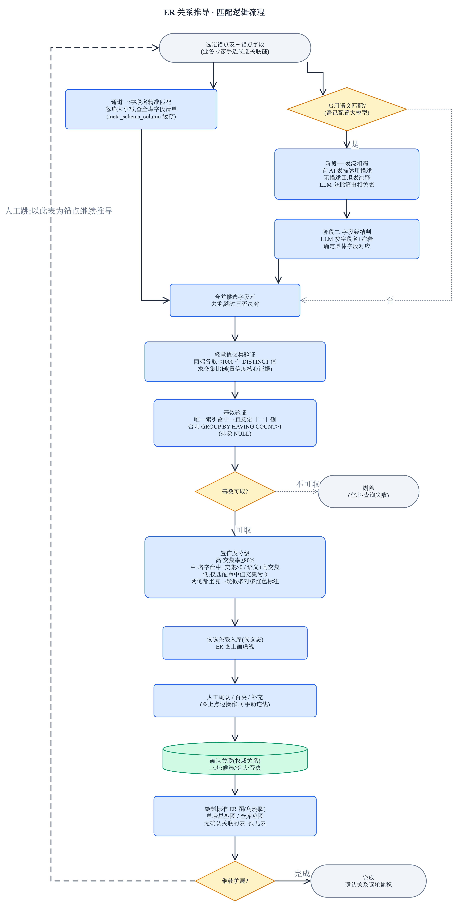

# ER 关系推导 — 需求讨论稿

> 状态:**已实施**,正式文档见 [docs/wiki/ER关系推导.md](../wiki/ER关系推导.md)(本文仅留作决策溯源)。
> 背景:各厂商建表不规范(无外键约束、字段命名混乱),常规数据库工具无法生成 ER 图;本功能通过程序逻辑推导表间关联,前端以标准 ER 图(乌鸦脚)展示。政府项目验收刚需。

## 匹配逻辑流程图

> 源文件:[ER关系推导-匹配逻辑流程.drawio](ER关系推导-匹配逻辑流程.drawio)(可编辑;侧边车 spec 在 `.drawio-tmp/er-relation-match/`)

## 术语表(已确认)

| 术语 | 定义 |
| --- | --- |
| **锚点表 / 锚点字段** | 用户(业务专家)选定的一张表和其中若干字段,作为一轮推导的出发点。锚点字段即「候选关联键」——用户凭业务知识选定,程序不做噪音过滤,选什么用什么;每个锚点字段可附带若干**映射名**(用户手填的、其他表中引用该字段的常见字段名,如 `id` → `work_order_id`),名字匹配按「本名+映射名」忽略大小写搜索 |
| **候选关联** | 程序推导出来、未经人工确认的表间关系 |
| **确认关联** | 经人工核准的权威关系;ER 图与后续导出只基于确认关联 |
| **否决关联** | 人工判定为误报的关系;入库保存,再推导时跳过该字段对,避免重复打扰 |
| **孤儿表** | 全库总图中没有任何确认关联的表 |
| **全库总图** | 全部确认关联的并集绘制出的 ER 图;不是实时推导的结果 |
| **轻量值交集验证** | 对已配对的候选字段对,两端各取最多 1000 个 DISTINCT 值求交集比例,作为置信度的核心证据。是值集匹配的「验证形态」而非「发现形态」 |

## 已确认的决策

1. **推导依据两种匹配方式**:① 字段名忽略大小写精准匹配;② 字段注释语义匹配(依赖大模型)。暂不做值集匹配(发现形态)。
2. **语义匹配打法(两阶段,原料逐级回退,不做覆盖率提示)**:
   - 阶段一·表级粗筛:对全库每张表,**有 AI 表描述(`table_doc.description`)就把该表描述与锚点表描述发给大模型**判断是否可能相关;**没有描述的表回退用表注释(数据库 comment)做语义匹配**;两者都无的表在语义通道出局(仍可被字段名精准匹配命中)。分批全量发给 LLM。
   - 阶段二·字段级精判:对粗筛出的每张表,将其字段名+注释与锚点字段逐批发给 LLM,确定具体字段对应关系;字段无注释的语义匹配出局。
3. **基数要推**:对配对字段两端跑 `GROUP BY 字段 HAVING COUNT(*) > 1`(排除 NULL)判 1:1 / 1:N。领域假设:水利对象基础表与业务表之间不存在 M:N;实际出现两侧都重复时图上红色标注「疑似多对多/推导存疑」交人工裁决,不画 M:N 线。
   - 索引短路:配对字段被某侧唯一索引/主键覆盖时,直接断定该侧为「一」,免跑聚合查询(`listIndexes` 现有能力)。
4. **置信度**:轻量值交集验证为核心证据,与匹配来源(名字/语义)组合成置信度。
5. **闭环**:程序推导(候选)→ 人工确认/否决/补充 → 入库成权威关系(候选/确认/否决三态)→ ER 图基于确认关联。
6. **N 跳 = 人工跳**:图上节点提供「以此表为锚点继续推导」,用户重新走选字段→推导→确认流程,逐圈扩展。
7. **入口三处**:① 表列表页行内「推导关联」按钮(弹窗选锚点字段);② 顶部独立「ER 关系」按钮(独立页签打开全库总图);③ 表字段明细页加按钮和 ER 关系页签。
8. **降级**:未配置大模型时语义匹配选项禁用,仅名字匹配,功能整体仍可用;语义匹配调用计入 `ai_usage_log`(新增场景枚举)。
9. **展示**:节点三档可选(仅表名 / 仅关联字段 / 全部字段);点击表名跳转字段明细页(新页签);技术选型 AntV G6,力导向与层次布局可切换。
10. **导出延后**:先把页面功能调通,图片/Word 导出最后再做。

## 待决问题(第三轮,多为默认拍板待异议)

- ~~表描述覆盖率~~ 已决:不做提示;每张表有描述用描述、无描述回退表注释语义匹配
- 启用语义匹配时推导异步任务化(分批 LLM 调用耗时长,参照扫描 1s 轮询惯例)
- 值交集 0% 是否仅降置信度(采样盲区,不自动否决)
- 置信度分级规则草案
- 图上交互:候选边点选确认/否决、手动连线补充关系
- 布局持久化(第一版建议不做)
