# 局域网共享功能 — 端到端测试报告

- **测试日期**:2026-09-07(初版 2026-09-06)
- **被测版本**:1.9.8 + `feature/lan-share` 分支(worktree `tools-lan-share`),含「同步前预览(逐行明细)+ 勾选同步 + 数据源映射」
- **测试方式**:Docker 容器化端到端(真实 UDP 广播 + 真实 HTTP 拉取 + 真实 MySQL 扫描数据 + headless Chrome 走真实页面)
- **测试结果**:**42 项断言全部通过(42 PASS / 0 FAIL)**,运行日志见 `evidence/e2e-run.log`

## 1. 测试环境

| 组件 | 说明 |
| --- | --- |
| 容器编排 | Docker Compose(OrbStack,Docker 29.4.0),独立 bridge 网络 `lan-e2e_lan` |
| `dq-lan-a` | dq-tool 实例 A(宿主机端口 10101 → 容器 10000),扮演数据产出方;数据源「演示MySQL」「分析库」 |
| `dq-lan-b` | dq-tool 实例 B(宿主机端口 10102 → 容器 10000),扮演数据消费方;数据源故意异名「我的MySQL」 |
| `dq-lan-mysql` | MySQL 8.4,预置演示库 `dqdemo`(2 张表:reservoir_info / water_level_log,含 NULL 与空串) |
| 测试 jar | `dq-tool-0.1.9.8.jar` 替换内嵌授权公钥为一次性测试密钥对(仅测试环境,未进仓库) |

关键点:两个实例容器在同一 bridge 网络内,发现走的是**真实二层广播**——容器 eth0 的子网广播地址
(192.168.148.0/24 → 192.168.148.255)由 docker 桥转发给网络内所有容器,无任何单播注入/打桩。
B 的数据源故意与 A 异名(「我的MySQL」 vs 「演示MySQL」),验证数据源映射而非同名巧合。

拓扑(见 `docs/局域网共享拓扑.png`):

```
        同一 bridge 网络(二层广播域)
   ┌───────────┐  UDP 心跳 17386   ┌───────────┐
   │  dq-a     │ ◌ ─ ─ ─ ─ ─ ─ ─ ▶ │  dq-b     │
   │ 实例A-小王 │ ◀ ─ ─ ─ ─ ─ ─ ─ ◌ │ 实例B-小李 │
   └─────┬─────┘                   └─────┬─────┘
         │   预览 GET share/*/preview    │
         │   数据源 GET share/datasources│  (密码为 TransferCrypto 密文)
         │   拉取 GET share/*(勾选+映射) │
         │  B ─────────────────────────▶ A
   ┌─────┴───────────────────────────────┴─────┐
   │              dq-lan-mysql (dqdemo)        │
   └───────────────────────────────────────────┘
```

## 2. 测试流程与结果

驱动脚本:`.lan-e2e/run-e2e.sh`(可重复执行);逐步证据 JSON 落盘于 `.lan-e2e/evidence/`,
关键证据副本见本目录 `evidence/`。

| # | 测试项 | 结果 |
| --- | --- | --- |
| 0 | 双实例启动就绪;MySQL 健康(种子数据就绪) | PASS |
| 1 | 双实例授权码激活(测试授权码,永久有效) | PASS ×2 |
| 2 | 设置实例名并经心跳广播;`/api/lan/status` 返回 running=true | PASS ×2 |
| 3 | A 造数:数据源「演示MySQL」「分析库」、标记「核心业务(AI)」「需治理(MANUAL)」、整库扫描 DONE(2 表)、表描述 2 条(分属两个数据源)、表级打标 ×2、所属系统「水库矩阵平台」 | PASS ×7 |
| 4 | B 建数据源「我的MySQL」(**故意与 A 异名**,验证映射而非同名巧合) | PASS |
| 5 | **UDP 广播自动发现**:B 的 peers 出现「实例A-小王的电脑」(httpPort=10000);A 同样发现 B(双向) | PASS ×2 |
| 5b | **同步前预览(含逐行明细)**:标注预览(2 标记 + 2 数据源分布 + 打标 2 行带表名/标记名 + 描述原文 + 所属系统);扫描任务预览 1 个 DONE 任务;**数据源共享清单**(含名称/地址/用户名 + TransferCrypto 密文密码,无明文);B 聚合预览含映射信息(对方 2 个数据源本机均无同名 matchedLocalId=null,本机清单含「我的MySQL」) | PASS ×7 |
| 6 | **勾选同步 + 数据源映射**:勾「核心业务」+描述+所属系统;「演示MySQL」→ 映射到「我的MySQL」,「分析库」→ 新建副本 → 只新建 1 标记、打标 +1、描述 2 条(含「分析库」上的)、所属系统 1 条、datasourcesCreated=["分析库"];B 只有「核心业务」没有未勾选的「需治理」;**B 的「分析库」hasPassword=true 且可直接连通 MySQL(密码密文随行生效)**;「分析库」上描述已落 | PASS ×11 |
| 6b | **增量补选**:二次拉取只勾「需治理」(异名映射)→ 新建该标记并补打标关系,描述不重复 | PASS |
| 7 | **勾选扫描任务 + 异名映射**:「演示MySQL」→「我的MySQL」,任务导入 1 个 | PASS ×2 |
| 8 | **幂等性**:全选重拉,扫描任务去重 skipped=1 / imported=0;标记按名合并 tagsCreated=0 | PASS ×2 |
| 9 | B 侧数据核验:两个同步标记齐全(含 tagType);reservoir_info 表描述一致;所属系统一致;扫描记录挂在「我的MySQL」上(DONE, 2/2 表);字段级明细可查看 | PASS ×5 |

## 3. 界面截图(完整操作流程)

截图由 headless Chrome(playwright-core 驱动)访问容器内实例真实页面采集,见 `screenshots/`。

**图 1 — B 的「局域网共享」页:自动发现实例 A**(`01-b-lan-share-peers.png`)


**图 2 — 点「同步标记与描述」→ 预览勾选弹窗:标记清单(颜色/类型/描述),默认全选**(`02-b-preview-annotations.png`)
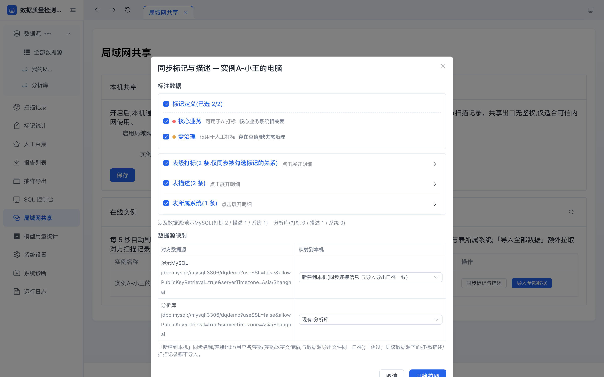

**图 3 — 展开「表级打标」逐行明细:哪张表、哪个标记、哪个数据源**(`03-b-preview-detail-tags.png`)


**图 4 — 数据源映射:对方「演示MySQL」本机无同名 → 默认「新建到本机(同步连接信息)」;「分析库」已匹配现有**(`04-b-preview-ds-mapping.png`)
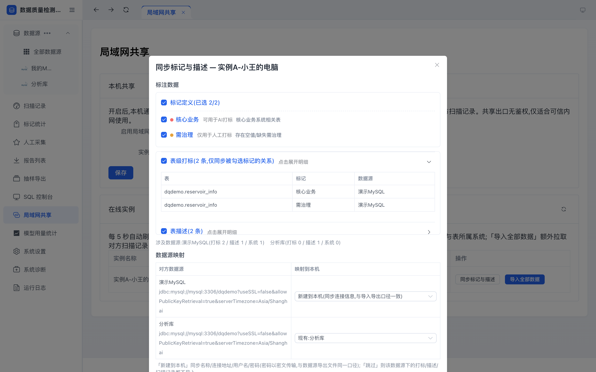

**图 5 — 映射下拉选项:现有本机数据源 / 新建到本机(同步连接信息,与导入导出口径一致) / 跳过**(`05-b-ds-mapping-options.png`)
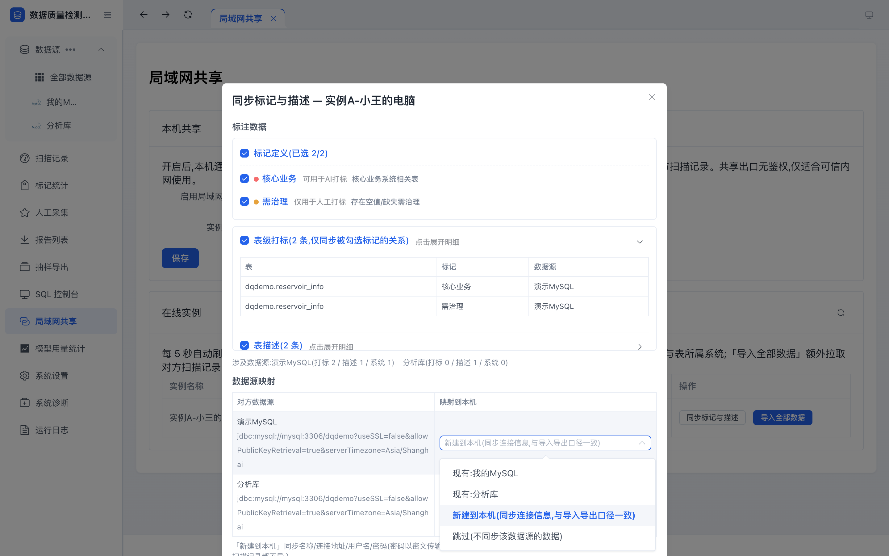

**图 6 — 取消勾选「需治理」,只同步「核心业务」(已选 1/2)**(`06-b-preview-annotations-partial.png`)
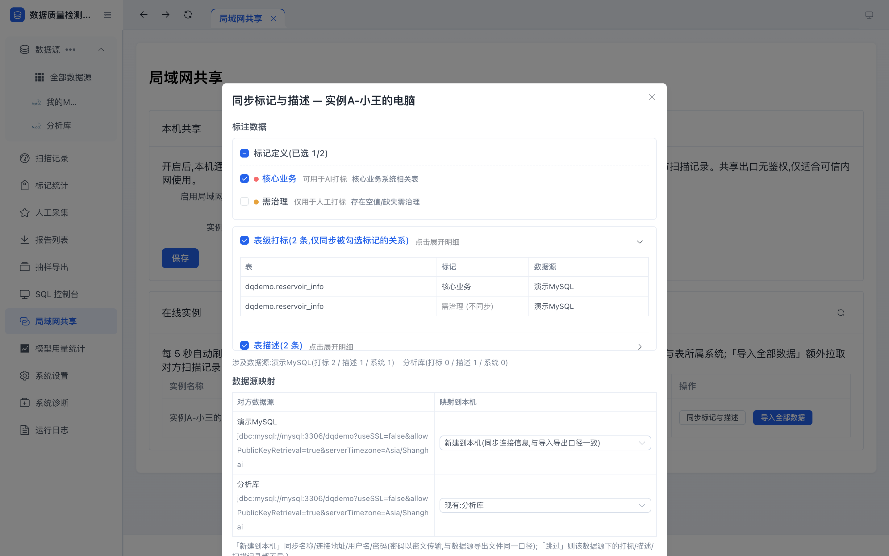

**图 7 — 同步完成:数据源副本已同步提示 + 标注合并计数**(`07-b-pull-result-annotations.png`)
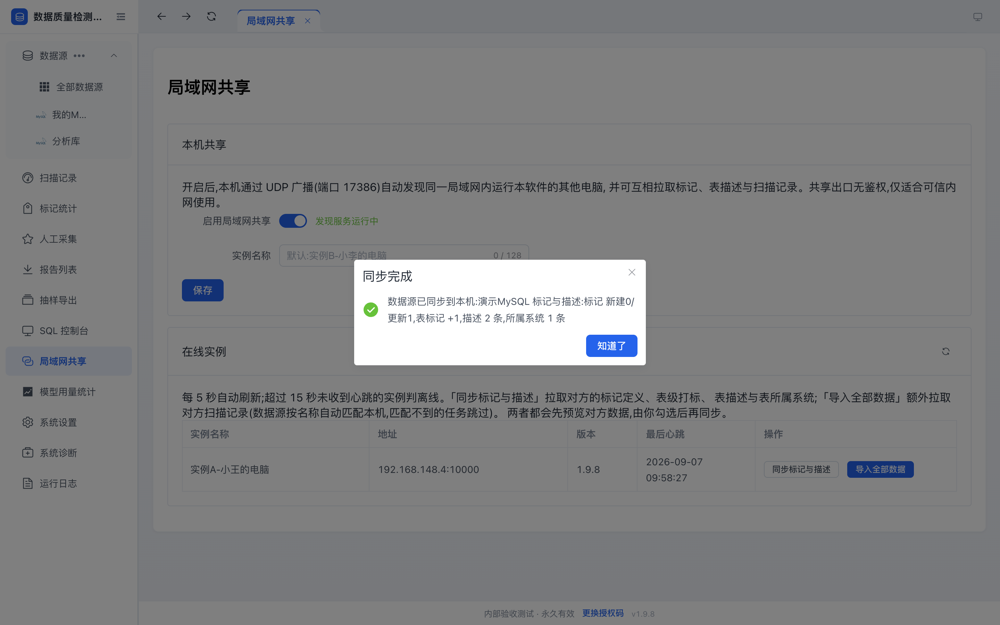

**图 8 — B 的数据源页:同步来的「分析库」副本已在列表(密码随行,可直接连通)**(`08-b-datasource-created.png`)
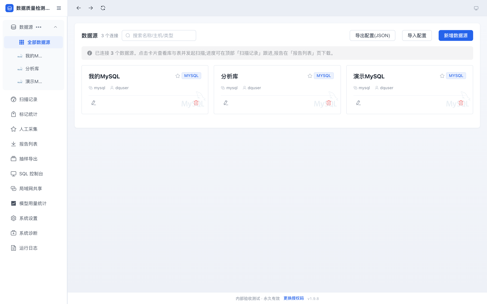

**图 9 — B 的标记统计页:同步来的「核心业务」「需治理」(标记类型与计数齐全)**(`09-b-tags-after-sync.png`)
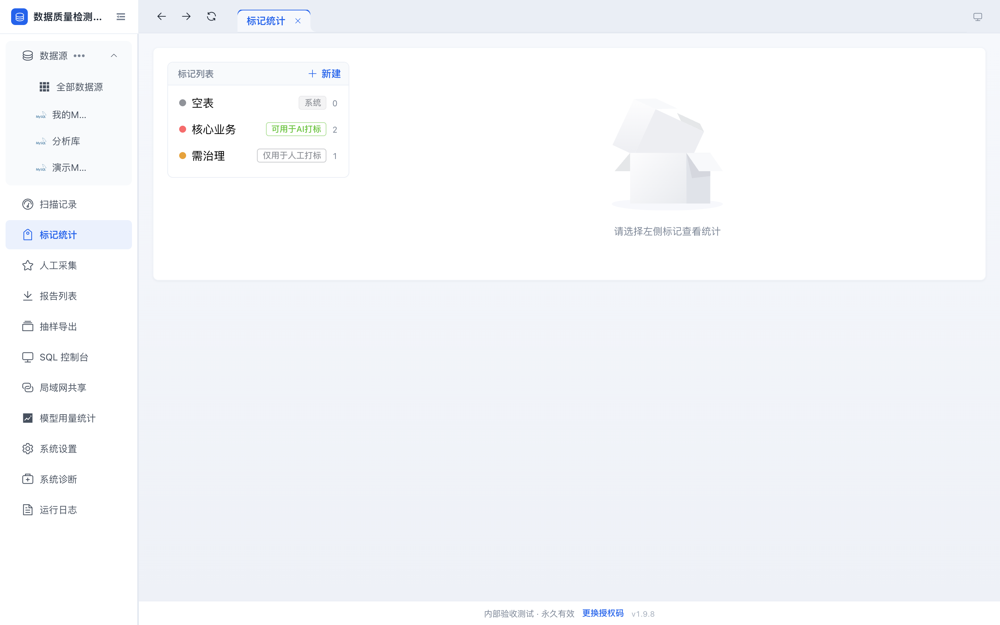

**图 10 — 点「导入全部数据」→ 预览弹窗:标注明细 + 数据源映射 + 扫描任务勾选表格**(`10-b-preview-all-with-jobs.png`)
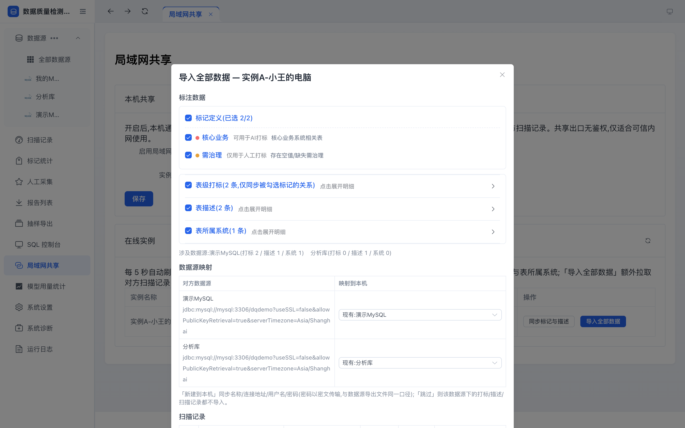

**图 11 — 导入全部数据结果:标注更新 + 扫描任务判重跳过(含跳过原因说明)**(`11-b-pull-result-all.png`)
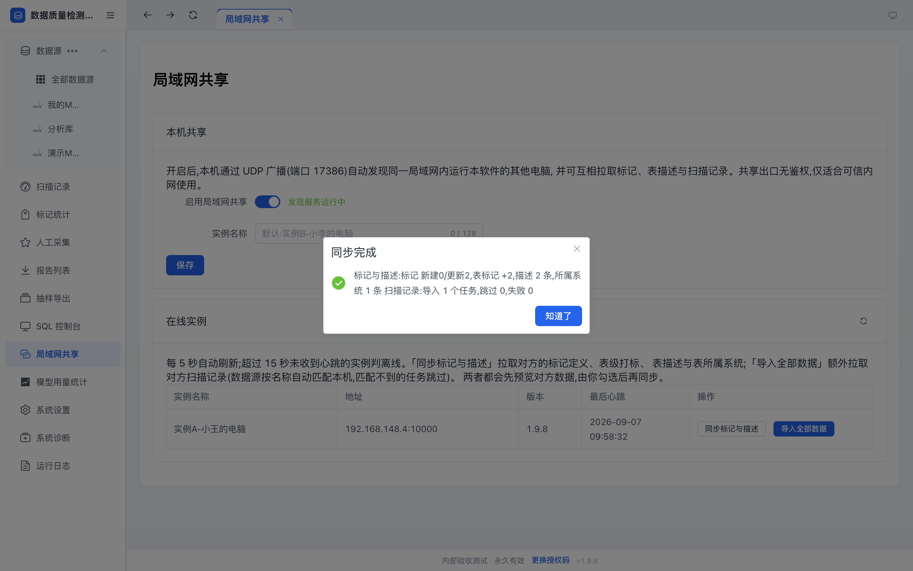

**图 12 — B 的扫描记录页:从 A 导入的任务挂在异名映射的「我的MySQL」上(DONE, 2/2 表)**(`12-b-scan-jobs-imported.png`)
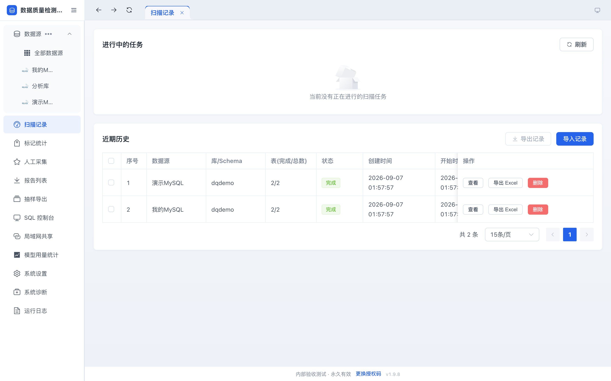

**图 13 — B 的表列表:reservoir_info 已带标记与同步来的表描述**(`13-b-tables-doc-tags.png`)
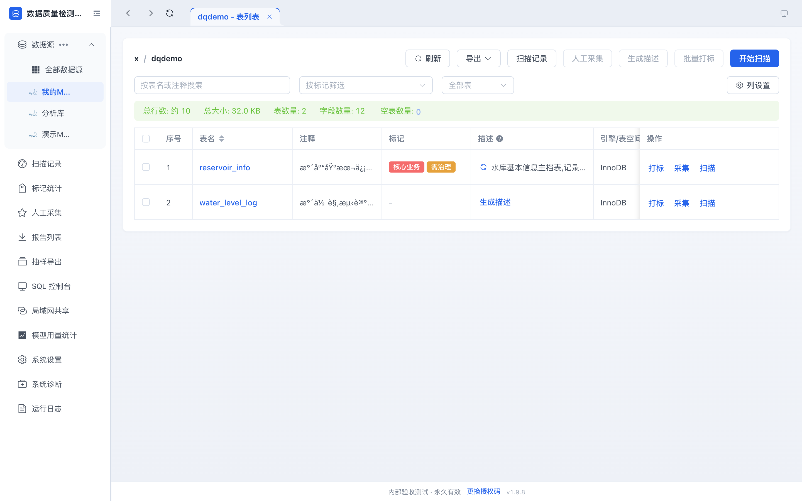

**图 14 — A 的「局域网共享」页:双向发现(A 看到 B)**(`14-a-lan-share-peers.png`)
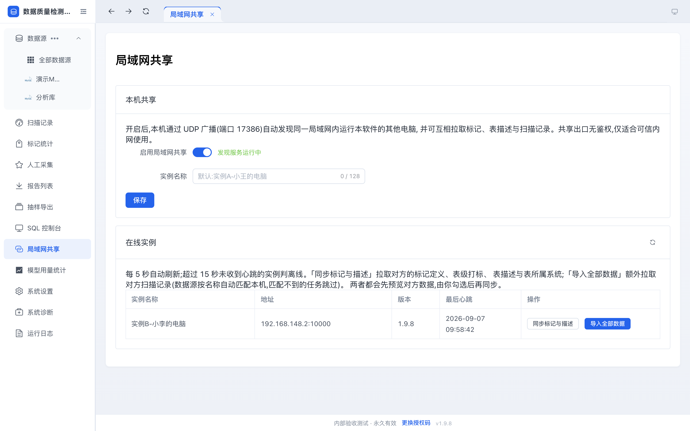

## 4. 测试中发现的问题与处理

| 问题 | 定性 | 处理 |
| --- | --- | --- |
| 手动编辑表描述接口(`PUT .../tables/{table}/doc`)只 UPDATE 已有行,从未生成过描述的表静默不落库 | **存量行为**,与局域网共享无关(AI 生成路径走 upsert 不受影响);UI 上该入口只在已有描述时可编辑 | 测试播种改走标准「标注导入」接口(upsert);建议后续单独评估是否修 |
| 图 13 表列表「注释」列中文乱码 | 演示环境 MySQL 8.4 + 驱动字符集细节(information_schema 注释按 latin1 解读),**与局域网共享无关**;同步过来的「描述」列中文正常 | 报告留痕,不阻塞验收 |

## 5. 结论

局域网共享的五项核心能力在真实容器网络下全部验证通过:

1. **自动发现**:双实例经 UDP 广播(17386)互相出现在对方在线列表,实例名/版本/心跳时间正确;
2. **同步前预览(逐行明细)**:拉取前可看到对方的标记清单、打标/描述/所属系统逐行内容与扫描任务列表;
3. **数据源映射**:对方数据源与本机异名时由用户指定映射;无对应时一键把对方数据源同步到本机(密码以 TransferCrypto 密文随行,与数据源导出文件同一口径——B 侧 hasPassword=true 且**实测可直接连通 MySQL**,清单中无明文均有断言);
4. **勾选同步**:部分勾选只同步所选,增量补选可后续单独拉;扫描任务按勾选 id 导入并落到映射后的数据源;
5. **幂等安全**:重复拉取不产生重复数据(任务级去重、标记按名合并)。

**验收结论:通过。**

## 6. 复现步骤

```bash
cd .lan-e2e
docker compose build && docker compose up -d   # 三容器:mysql + dq-a + dq-b
./run-e2e.sh                                    # 42 项断言,证据落 evidence/
cd shots && node capture.js                     # 界面截图(需本机装有 Chrome)
docker compose down -v                          # 清理
```
